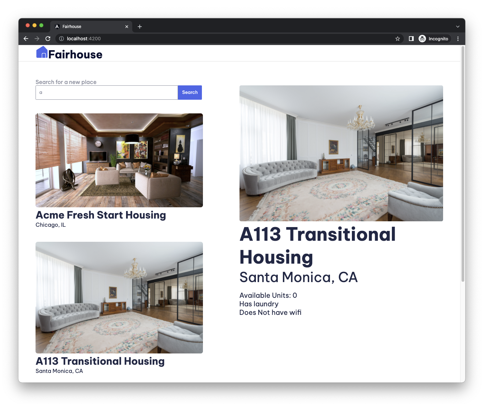

# Introduction to Angular Codelab

In this codelab, you'll build a housing app with Angular. This is the completed app and features the ability to view home listings based on user search, and view details of a housing location.

You'll build everything with Angular using Angular's powerful tooling and great browser integration.

Here's a preview of the application:

The step-by-step guide can be found at [https://codelabs.developers.google.com/introduction-to-angular](https://codelabs.developers.google.com/introduction-to-angular)